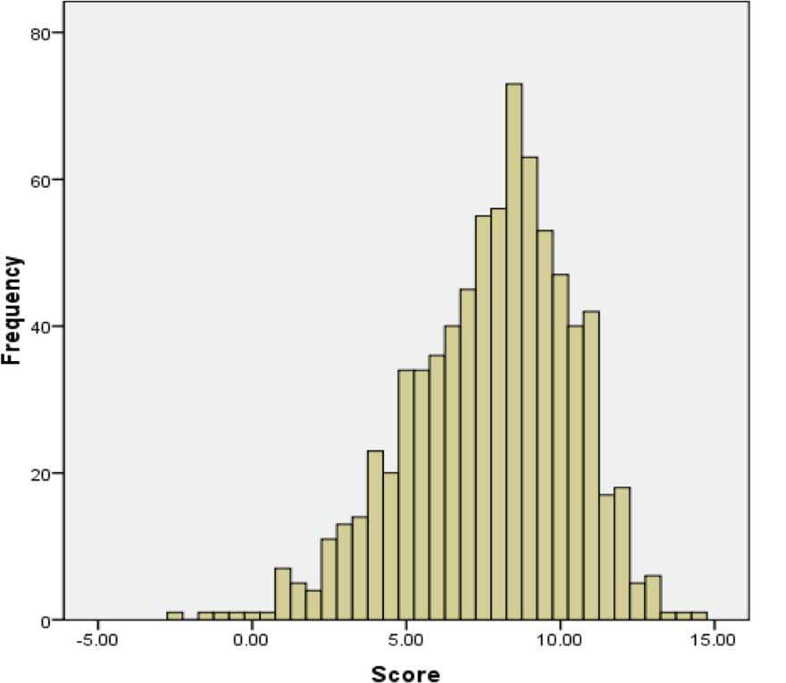

##Introduction

  In today's world, we can get any information we want, be it medical diagnosis or directions to go somewhere, over the internet. Same is the case with programming assignments, students can get all the source code for the assignment over the internet, creating a risk of intentional or unintentional plagiarism. The internet can be a great source of knowledge for the ones who look for it, but if someone just copies the source code for the assignment over the internet, they are not learning anything from it and are failing the sole purpose of the assigned task. Plagiarism in programming assignments is one of the most common things in computer-based courses, and it is increasing every year. Although it is not clear if the increase is due to the improved algorithm for plagiarism checking or more number of students involving in plagiarism. Students should know the value and purpose of the task assigned to them, and they should also be aware of how to prevent themselves from plagiarism. This is the reason teachers should create awareness not just about plagiarism in text-based assignments but also for programming assignments. Students should be taught what is right and what is wrong.

Plagiarism in programming assignments is different from the text-based assignments, and there is no common definition for source-code plagiarism. According to Faidhi and Robinson [-@Sanjay_Rao], "plagiarism occurs when programming assignments are copied and transformed with very little effort from the students", whereas Joy and Luck [-@Sanjay_Rao] define plagiarism as, "unacknowledged copying of documents and programs". A lot of institutions use text similarity-based plagiarism detection tools for programming assignments, which is not an effective way to do it. The lexical elements of the code can be modified while retaining the structure and logic of copied source code, and a text similarity plagiarism detector cannot detect that. In this paper we will talk about, how much do students know about source code plagiarism and some of the softwares for source code plagiarism detection.

##Student's knowledge about plagiarism in programming

There has been a lot of research on how to improve plagiarism detectors in the past few years and very few answering the main problem causing it, “Do the student know what constitutes as plagiarism?”, Paul Clough [-@Paul]. It is very important for the students to have a clear idea of what is right and what is wrong. Most institutions focus on teaching students about plagiarism in text-based assignments and not about plagiarism in programming code. The definition of plagiarism is very different between the two.  If the institutions start focusing on teaching the students, the correct ways to avoid plagiarism in programming assignments this would reduce a lot of unintentional plagiarism.

In the paper, “Source code plagiarism- A student’s perspective” [-@Mike_Cosma_Jane2], the authors, conducted a survey for students from computer background all over UK and Europe, to find out how much students knew about Plagiarism in Programming. There were 15 questions in the survey and for every right answer the student got +1 points and for every wrong answer, the student got -1. The total number of students who participated in the survey was 770, of which 615 were from UK and 87 from Europe and the remaining from the rest of the world. The mean score obtained by students in Europe and UK was just 7.6 out of 15. Figure-1 gives us a clear idea that students lack knowledge in the field, or there is some confusion in them about what is plagiarism. The frequency plot for the scores obtained by the students shows clearly that only a few have a clear idea about the subject of source code plagiarism. 

{width=300px}

The findings give a clear message that, along with detection and enforcement of appropriate penalties, it is also necessary to look beyond to understand clearly why plagiarism is so widespread. This study gives us a clear idea that for students writing program code, the training given is not effective in raising awareness of what constitutes plagiarism. Some areas of confusion in student’s mind are debatable, such as self-plagiarism and different definitions of plagiarism between institutions.

In my opinion, the results obtained by the survey clearly state that there is a lack of knowledge in students about plagiarism in programming. The mean score obtained by the students was approximately half of the total score. According to the plot shown in Figure-1, only ten students were able to score above 12 out of 15, and more than 80% of the scores
were below 10. I think, this gives us a clear understanding that just focusing on improving the plagiarism detection algorithms won’t solve the problem, institutions should also start focusing on why the students are involving in plagiarism. This would be a great step towards minimizing plagiarism in programming assignments.

##Plagiarism detection in programming languages

Automated methods for finding plagiarism in student’s source code submissions have been in use for a very long time and there are many available search engines and services for it. The most common and effective technique for plagiarism detection in the source code is tokenizing the code and then searching a pair of submissions for long common substrings. According to Thomas Lancaster [-@Thomas_Fintan], some of the widely used services, that use this technique for plagiarism detection in the source code, are MOSS and JPlag. These are the services that are used by a majority of the institutions for detecting source code plagiarism in student submissions. Although this detection is well established, future research for improving these are going on and a lot of extensions have been made for these methods to improve results. PlaGate, as described by Mike Joy and Georgina Cosma [-@Mike_Joy_Cosma], is one such extension created. It is a novel tool that can be integrated into the existing detection tool to improve the performance. PlaGate implements a new approach for investigating the similarities between source code with a view to gathering evidence for proving plagiarism.

MOSS (Measure of Software Similarity), developed in 1994, as described in a paper by Sun Zhigang  [-@Sun_su_zhu] is an automatic system for detecting the similarity of programs. MOSS was created for detecting similarities between software’s, but to date, the main application of MOSS is detecting plagiarism in programming classes at institutions. The input to MOSS is a set of programs, and it returns references, the teacher must manually check through the references to confirm who is cheating. The only weakness of MOSS is that it does not do a web search, but this is not a big problem as it common that for a large class, more than one student copies code from the same source. MOSS can easily catch such similarities. On using extensions like PlaGate with MOSS we will get exact results for students involved in cheating with evidence. 

JPlag, described in a paper by Lutz Prechelt [-@Lutz_Guido_Michal], is another such service for source code plagiarism detection. It is written in Java programming language and this works only with programming languages that are similar in syntax to Java. JPlag is mostly used for plagiarism detection with languages like Java, C, C++. The input to JPlag is a set of programs. It compares these programs pairwise, computing total similarity value for each pair and a set of similarity regions. JPlag converts each program into a string of canonical tokens. For the comparison of two programs, JPlag then covers one such token string by substrings taken from the other where possible.

Source code plagiarism detection is a field of active research. According to me, using a good detection system to check student’s assignments for plagiarism, creates a fear among the students and motivates them to work on their assignments instead of copying it from someone. This is one of the best ways an institution can control intentional plagiarism.

##Conclusion
 
I think, programming assignments are important part of a course curriculum as they give the required practical experience to the students. It plays a key role in shaping the learning curve of students. I think if proper knowledge is not provided to the students about plagiarism in programming assignments and appropriate techniques are not used for
detecting plagiarism in source code, the students are the one who suffer. They miss out on the most important part of the learning curve of the course. Students should be made aware of the consequences of plagiarism, that would motivate them to put some effort on their assignments.

According to me, institutions could include a project in the course for students from computer-based courses where the student is supposed to develop a basic plagiarism detection system. This could be a great way for the students to gain knowledge of how a source-code plagiarism detection system works and what constitutes as plagiarism. This could reduce a lot of unintentional plagiarism in programming assignments. I conclude, if the students are made aware of the techniques to use to avoid plagiarism in programming and proper services, like MOSS and JPlag, are used by institutions to detect plagiarism in programming assignments, this would reduce plagiarism and even benefit the learning of students.

###References

