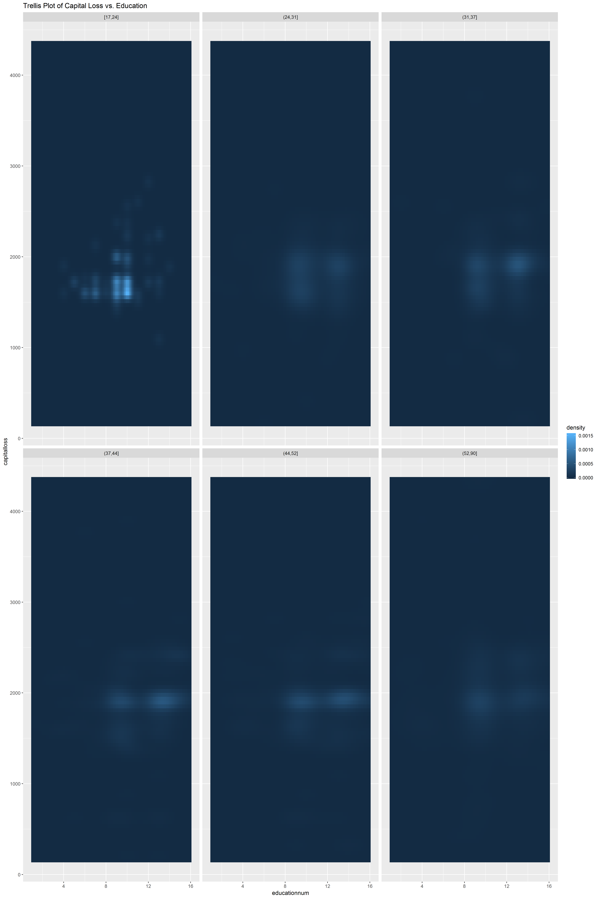

```{r setup, include=FALSE}
knitr::opts_chunk$set(echo = TRUE)
```

```{r warning=FALSE, echo=FALSE, include=FALSE}
library(dplyr)
library(plotly)
library(ggplot2)
library(seriation)
library(GGally)
```

##Assignment 1

###1 Reading Data price_and_earnings

Reading data into variable "p_e". I am setting the first column of city names as Row names for the data.This is the reason I am subtracting 1 from the required columns we were asked to select.

```{r warning=FALSE, echo=FALSE}
p_e = read.table("prices-and-earnings.txt", header=T, sep = "\t", row.names = 1)
requiredCols = c(2,5,6,7,9,10,16,17,18,19) - 1
p_e = (p_e[,requiredCols])
head((p_e[,]))
```

###2

It is hard to find any clusters in this heatmap. It is even hard to spot outliers.There are 72 citys in the dataset,but we cannot see all the 72 on the y axis labels due to lack of space.All the points are being plotted but its not shown on y axis labels as there is no space for all of them.If we hover through the plot we would be able to find the corresponding city name. We can also zoom into the area of interest on the heatmap and that would show us all the labels for the zoomed region.

```{r warning=FALSE, echo=FALSE}
p_e.numeric = (scale(p_e))
plot_ly(x=colnames(p_e.numeric), y=rownames(p_e.numeric), 
        z=p_e.numeric, type="heatmap", colors =colorRamp(c("yellow", "red")))%>%
  layout(title = "Heatmap without reordering")
```

###3

Both the plots are almost similar, its just both have different ordering of rows due to the different ways of computing the distance matrix. It looks like in the correlations heatmap, the ordering of the rows in just oposite to the one in Euclidean distance heatmap. But the clusters found in both the heatmaps are almost similar. 

Althouth it is hard to tell which one is doing better, I think heatmap based on Euclidean diatance is better in reordering, as the clusters are clearer in this heatmap.

The heatmap plot based on the reordered matrix calculated using eucledian distance gives us a much clearer picture of the data. Previously we were not able to spot clusters at all in the Heatmap from the unordered matrix. But now the reordering has made it easy to spot the clusters. I found 3 prominant clusters in this reordered data. 

The first largest cluster is one from Geneva to Dubai. 

Another smaller cluster is from Athens to Lisbon.

And the third one is from Shanghai to Caracas.

```{r warning=FALSE, echo=FALSE}
row_dis = dist(x = p_e.numeric, method = "euclidean", diag = T)
col_dis = dist(x = t(p_e.numeric), method = "euclidean", diag = T)
row_cor = 1 - cor(t(p_e.numeric))
col_cor = 1 - cor(p_e.numeric)
order1_euc = seriate(row_dis, "OLO")
order2_euc = seriate(col_dis, "OLO")
ord1_euc = get_order(order1_euc)
ord2_euc = get_order(order2_euc)
order1_cor = seriate(as.dist(row_cor), "OLO")
order2_cor = seriate(as.dist(col_cor), "OLO")
ord1_cor = get_order(order1_cor)
ord2_cor = get_order(order2_cor)

reordered_euc = p_e.numeric[rev(ord1_euc), ord2_euc]
reordered_cor = p_e.numeric[rev(ord1_cor), ord2_cor]

plot_ly(x=colnames(reordered_euc), y=rownames(reordered_euc), 
        z=reordered_euc, type="heatmap", colors =colorRamp(c("yellow", "red"))) %>% 
  layout(title = "Heatmap of reordered matrix using eucledian distance")

plot_ly(x=colnames(reordered_cor), y=rownames(reordered_cor), 
        z=reordered_cor, type="heatmap", colors =colorRamp(c("yellow", "red"))) %>% 
  layout(title = "Heatmap of reordered matrix using correlations")
```

###4

I think the clusters are much more clear for the heatmap from matrix obtained from the Traveling Sales Person optimization. The reordering of the matrix using the TSP optimization make identifying clusters much easier. The same 3 clusters identified in the heatmap from HC optmizer are visible here in a better way.

In this case there is not much of a difference in the path length obtained from the two optimization techniques. The reordered matrix from TSP optimization had path length smaller than the reordered matrix from HC optimization.

TSP optimization had much smaller Gradient_raw than the HC optimization. There was a difference of 37338 between the two gadients.

```{r warning=FALSE, echo=FALSE}
order1_tsp = seriate(row_dis, "TSP")
order2_tsp = seriate(col_dis, "TSP")
ord1_tsp = get_order(order1_tsp)
ord2_tsp = get_order(order2_tsp)

reordered_tsp = p_e.numeric[rev(ord1_tsp), ord2_tsp]


plot_ly(x=colnames(reordered_tsp), y=rownames(reordered_tsp), 
        z=reordered_tsp, type="heatmap", colors =colorRamp(c("yellow", "red"))) %>% 
  layout(title = "Heatmap of reordered matrix using TSP")

rbind("HC" = criterion(dist(reordered_euc), method = c("Gradient_raw", "Path_length")),
      "TSP" = criterion(dist(reordered_tsp), method = c("Gradient_raw", "Path_length")))
```

###5

I was able to find two clusters in the data using parallel coordinate plot for unsorted data. I was able to identify the clusters when I rearranged the columns in the plot. 

The first cluster in the light shade of blue is mainly defined by the variable IPhone4s. The coodrinates of this cluster are groued at the variable Iphone4s near the range 0-60. This is the most well defined cluster which follows the same trend if the columns are reordered properly. The coordinates follow a trend of going upwards when I rearranged the variables manually.

The second cluster was not identifiable at first, the cluster in the dar shade of blue follows the same trend for most of the variables. The variable that defines this cluster the best is Net Wage as the lines get close near the range 0-40. This cluster is not too well defined as the first one but the line are parallel to each other for majority of the variables.

According to me the most prominant outlier were bread and food cost. Most of the Coordinates broke the trend near them going far away from the cluster.

```{r warning=FALSE, echo=FALSE}
colnames(p_e) = c("FoodCosts", "iPhone4S", "ClothingIndex", "Hours", "NetWage", "VacationDays", 
                          "BigMac", "Bread", "Rice", "GoodsServices")
p_e %>% plot_ly(type = 'parcoords', 
                            dimensions = list(
                              list(label = "Food Costs", values = ~FoodCosts),
                              list(label = "iPhone 4S", values = ~iPhone4S),
                              list(label = "Clothing Index", values = ~ClothingIndex),
                              list(label = "Hours Worked", values = ~Hours),
                              list(label = "Wage Net", values = ~NetWage),
                              list(label = "Vacation Days", values = ~VacationDays),
                              list(label = "Big Mac", values = ~BigMac),
                              list(label = "Bread", values = ~Bread),
                              list(label = "Rice", values = ~Rice),
                              list(label = "Goods Services", values = ~GoodsServices)))

d=p_e
d$iPhone4S_cluster=ifelse(d$iPhone4S <= 60, 1, 0)
d %>% plot_ly(type = 'parcoords',
                line = list(
                  color = ~iPhone4S_cluster,
                  colorscale = list(
                    c(0, 'green'),
                    c(1, 'red')
                  )
                ), 
                dimensions = list(
                  list(label = "Food Costs", values = ~FoodCosts),
                  list(label = "iPhone 4S", values = ~iPhone4S),
                  list(label = "Clothing Index", values = ~ClothingIndex),
                  list(label = "Hours Worked", values = ~Hours),
                  list(label = "Wage Net", values = ~NetWage),
                  list(label = "Vacation Days", values = ~VacationDays),
                  list(label = "Big Mac", values = ~BigMac),
                  list(label = "Bread", values = ~Bread),
                  list(label = "Rice", values = ~Rice),
                  list(label = "Goods Services", values = ~GoodsServices)))
```

###6

The two clusters I found were - 

First one including Cairo, Delhi, Mexico, Doha, Lima, Mumbai, Bangkok, Tokya

Second one includes Vienna, ansterdam, Auckland, Brussles, Lyon, London, Munich, Rome and Stockholm

These were the two clusters I was able to identify in the radar plot. The most distinct outlier I found was Food cost.

```{r warning=FALSE, echo=FALSE}
reordered_euc <- as.data.frame(reordered_euc)
reordered_euc$City = row.names(reordered_euc)

reuc_transformed <- reordered_euc%>%tidyr::gather(variable, value, -City, factor_key=T)%>%arrange(City)

radar_plot <- reuc_transformed %>% ggplot(aes(x=variable, y=value, group=City)) + geom_polygon(col = 'red', fill="blue", alpha = 0.5) + coord_polar() + theme_bw() + facet_wrap(~ City) + theme(axis.text.x = element_text(size = 5))

ggsave("radar_plot.png", width = 40, height = 60, units = "cm")
```

```{r pressure, echo=FALSE, out.width = '100%'}

```

###7

According to me the most efficient tool for analysing this kind of data is using parallel coordinates plot. It was simple to spot clusters and outliers in it once we manually found a good ordering for the variables. The outliers can easily be spotted in a parallel coordinate plot but Heatmaps are better for spoting outliers. I would say parallel coordinates and heatmaps are the most efficient and simple tools to use if our goal is to find clusters or outliers in a sorted dataset.

Analysing the radar plots was a tedious task. It could be good for a small dataset but manually looking for identical shapes in a large dataset is not an efficient way to work. Parallel coordinates and Heatmaps are much better ways for identifying clusters and finding outliers.


##Assignment 2

###Q1
```{r warning=FALSE, echo=FALSE}
adultdata<-read.csv(file ="adult.csv",header=FALSE,sep = ",")
colnames(adultdata)<-c("Age","workclass","fnlwgt","education","educationnum","marital"
                      ,"occupation","relationship","race","sex","capitalgain","capitalloss","Hoursperweek"
                      ,"site","Income_level")
```
####Scatter plot 
```{r warning=FALSE, echo=FALSE}
p<-ggplot(adultdata,aes(x=Hoursperweek,y=Age,color=Income_level))+geom_point()+geom_smooth()+
  ggtitle("Scatter Plot - Hours/Week vs Age")
ggplotly(p)
```

There is a problem of occlusion with a large number of observations plotted on a scatter plot. Not much can be derived from the scatter plot. People with income below 50K$ work longer hours at older ages.
####Trellis plot
```{r warning=FALSE, echo=FALSE}
p1<-ggplot(adultdata,aes(y=Age, x=Hoursperweek, color=Income_level))+geom_point()+geom_smooth()+
  facet_grid(Income_level~.) + ggtitle("Trellis grid Plot - Hours/week vs Age" )                              
ggplotly(p1)
```

In the Trellis plot above, it can be seen that person's with the income above 50K$ are mostly working between 25 to 75 hours per week.

###Q2
```{r warning=FALSE, echo=FALSE}
p2<-ggplot(adultdata,aes(x=Age,color=Income_level,fill=Income_level))+geom_density(alpha=0.2)+ggtitle("Denisty Plot - Age")
ggplotly(p2)
```

Most people earning lesser than 50K$ per year are in their early 20's. Most people earning higher than 50K$ per year are in the age group of 35 to 45 years old.

```{r warning=FALSE, echo=FALSE}
p3<-ggplot(adultdata,aes(x=Age,color=Income_level))+geom_density(alpha=0.2)+
  facet_wrap(~marital)
ggplotly(p3)
```

From the Trellis plot, we can observe that income levels do not affect Married-AF-spouse, Divorced, Separated and Widowed people as the plots nearly match both income groups. The largest difference in age is amongst Never married people. It can also be observed that Widowed people work more than all other groups.


###Q3
```{r warning=FALSE, echo=FALSE}
p4<-adultdata %>% filter(capitalloss!=0) %>% plot_ly(x =~educationnum,y= ~Age, z= ~capitalloss) %>% add_markers(size=0.2,opacity = 0.2)%>% layout(scene = list(xaxis = list(title = 'Education'), yaxis = list(title = 'Age'), zaxis = list(title = 'Capita lLoss')))
p4
```

It is difficult to analyse this plot as there is occlusion of data. With marker size and opacity reduced, we can still see overplotting but it is observed that two cluster emerge from this data.
Persons with education with a bachelors or masters degree have and person with high school education, Class 12 or some college education have high capital losses and this observation is unifrom across all working ages

```{r warning=FALSE, echo=FALSE}
adultdata$Agedisc1 <-cut_number(adultdata$Age, 6)
raster_3d1 <- adultdata %>% filter(capitalloss != 0) %>% ggplot(aes(x=educationnum, y=capitalloss)) + stat_density_2d(aes(fill = stat(density)), geom = "raster", contour = FALSE) + facet_wrap(Agedisc1~.) + ggtitle("Trellis Plot of Capital Loss vs. Education")
raster_3d1
ggsave("raster_3d.png", width = 40, height = 60, units = "cm")
```

```{r pressure1, echo=FALSE, out.width = '100%'}

```

###Q4
####Q4a
```{r warning=FALSE, echo=FALSE}
adultdata$Agedisc2 <-cut_number(adultdata$Age, 4)
size_3d2 <- adultdata %>% filter(capitalloss != 0) %>% ggplot(aes(x=educationnum, y=capitalloss)) + stat_density_2d(aes(size = stat(density)), geom = "point",n=15, contour = FALSE) + facet_wrap(Agedisc2~.) + ggtitle("Trellis Plot of Capital Loss vs. Education")
size_3d2
```

####Q4b
```{r}
Agerange <-lattice::equal.count(adultdata$Age, number=4, overlap=0.10) #overlap is 10%

 

L<-matrix(unlist(levels(Agerange)), ncol=2, byrow = T)

 

L1<-data.frame(Lower=L[,1],Upper=L[,2], Interval=factor(1:nrow(L)))

 

index=c()

Class=c()

for(i in 1:nrow(L)){

  Cl=paste("[", L1$Lower[i], ",", L1$Upper[i], "]", sep="")

  ind=which(adultdata$Age>=L1$Lower[i] &adultdata$Age<=L1$Upper[i])

  index=c(index,ind)

  Class=c(Class, rep(Cl, length(ind)))

}


df4<-adultdata[index,]
df4$Class<-as.factor(Class)
df4 %>% filter(capitalloss!=0)
ggplot(data = df4, aes(x=educationnum, y=capitalloss)) +
geom_point() + facet_wrap(~Class) + ggtitle("Education vs. Capital Loss using Shingles")
```

The advantage is that we can see the observations more clearly in a continuous fashion. The disadvantage is that we do not see the frequency of observations with the same values. Also, that choosing the optimum overlap is important, otherwise there would be redudunacy of data. Likewise, In the scatter trellis plot, The binning size is important and should be correctly chosen for proper analysis.


### Apendix
```{r, ref.label=knitr::all_labels(),echo=TRUE,eval=FALSE}
```