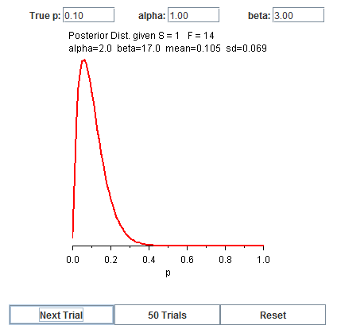

```{r setup, include=FALSE}
knitr::opts_chunk$set(echo = TRUE)
```

#Part 1

##Q- 4.84

```{r echo=FALSE, out.width = '100%'}

```

###a- According to the plots the Gamma Distribution with smaller value of alpha are more left skewed. As the value of alpha increases the standard deviation of the plots increase and the skewness decreases and the plots are more symmetric. The plot with alpha value of 80 and beta value of 1 is least skewed and most symmetric.

###b- Since the mean of a Gamma Density function is (alpha*beta) as the value of alpha increases the mean of the density function increases and so the density plot shifts.

###c- Since the mean of a Gamma Density function is given by (alpha*beta), as the value of alpha increases (4, 40, 80) the mean of the density plot also increases respectively(4x1, 40x1, 80x1). This is the reason the density plots shift. The variance of the plots also increase as the value of alpha increases. This is the reason the density plots are more spred out for larger values of alpha.


##Q- 4.117

```{r echo=FALSE, out.width = '100%'}

```

###a- These density functions are skewed right.

###b- As the values of alpha increase the skewness increases. The density plots gets more skewed towards right. The variance of the plot decrease and the mean increases as alpha increases. This is the reason the density plots increases in height and shift towards right as alpha increases.

```{r echo=FALSE, out.width = '100%'}

```

###c- We obeserve the same pattern. As we keep increasing alpha the variance decreases and the plots gets taller. The mean also increases as we increase alpha, this is how the plots shift. A right skewness decreases as we increase the value of Beta.

##Q- 4.118

```{r echo=FALSE, out.width = '100%'}

```

###a- When beta is greater than alpha the plots are all going along the y-axis. The plots are going up to infinity. The change in the value of beta does not make much of a difference in the plot.

###b- All the plots look similar to me. The change in value of beta makes no visible changes to the plot. On increasing the value of beta to a very large number I found that the tail height decreases as beta is increased to a large number.

###c- The plot with smallest beta value will have the highest probability of getting a value greater than (0.2). So in this case the plot(alpha=0.3 and beta=4) has the highest probability of getting a value greater than (0.2).

###d- The smaller the value of alpha the smaller will be the tail height, and as the value of beta decreases the tail height increases. 

##Q- 10.11

```{r echo=FALSE, out.width = '100%'}

```

###a- The only possible error in the given scenario is Type 2 error(fail to reject H0 given it is false). 

```{r echo=FALSE, out.width = '100%'}

```

###b- The proportion for Error is (0.870). The Reject_rate and Error_Rate add up to one. So I would say they are inversly related. As one of them increases the other decreases. In this case we have a high error rate (0.870) and this corresponds to a low reject_rate (0.130). 

```{r echo=FALSE, out.width = '100%'}

```

###c- Yes the change in sample size changes the error_rate. As the sample size increases the error_rate goes down and the reject rate goes up. The error rate for sample size (15, 30, 50, 100) were (0.870, 0.847, 0.635, 0.430) respectively. So the as we increase the sample size the chances of Type 2 error is decreased in a simulation.

##Q- 10.12

```{r echo=FALSE, out.width = '100%'}

```

###a- We get a smaller value for beta when the value of alpha is increased to (0.1) for sample size of 15. The value of beta for sample size 15 and alpha (0.1) was (0.785) and for alpha (0.05) was (0.870).

###b- The change in value of alpha reduced the error rate initially for small sample size but as we increase the sample size to the large, like 100, they both (alpha=0.05 and alpha=0.1) get the same error_rate. The error_rate is consistently lower for the larger value of alpha(0.1) but as the sample size is made large(100) the error_rate for both is same(0.430). 

##Q- 11.6

```{r echo=FALSE, out.width = '100%'}

```

###a- Intercept of line with slope zero is - (43.362)

```{r echo=FALSE, out.width = '100%'}

```

###b- The points are positively correlated so I dont think a line with negative slope will fit the data. It will produce the line with maximum error as it would be perpendicular to the good fit line to the data. The SSE increases as we change the slope of the line to be negative(increases from 1002 to 3818).

```{r echo=FALSE, out.width = '100%'}

```

###c- The equation of line obtained by manually finding a good fit was 

Y = 21.614 + 4.833*X

SSE - 18.289

Changing the slope and intercept increases the value for SSE.

```{r echo=FALSE, out.width = '100%'}

```

###d- The line I manually fit is almost close to the best fit line. There was not much of a change in the value of SSE. The SSE value decreased from (18.289) to (18.286). It changed by (0.003). The slope and intercept also dont change much. It just moves by some decimal places.
The best fit line equation was

Y = 21.575 + 4.842*X

SSE = 18.286

###e- The Y-intercept for the best fit line is (21.575).

```{r echo=FALSE, out.width = '100%'}

```

###f- The further the line is from the true point, the larger is the square. The lager the square, the larger would be its contribution to the total squared error(SSE). To find the best fit line we try to minimize the size of as many such square as possibel to find a line that has the least possible SSE.

##Q-11.50

###a-  The value to r^2 gets closer to one as the line fits the data better. So as the fit improves the value of r^2 increases and gets closer to one. For the best fit line found manually, the value of r^2 is (0.982).

###b- The value of r^2 does not change on getting the best fit as the line fit found manually was close to the best fit line.

###c- Since the data in this example are correlated(positively) a straight line fit is good for this case. Since the line fits the data well the value of r^2 is higher for this example.

##Q-16.4

```{r echo=FALSE, out.width = '100%'}

```

###Posterior for n=0

```{r echo=FALSE, out.width = '100%'}
knitr::include_graphics("16_4_a.png")
```

###a- On taking a sample of size n=1 I observed a failure. The tail of the distribution got thinner on observing a failure.

```{r echo=FALSE, out.width = '100%'}

```

###b- I observed two failures on taking a sample of size n=2. Yes the posterior looks different from that is part a. The tail of the posterior got even thinner.

```{r echo=FALSE, out.width = '100%'}

```

###c- I observed my first success on my 4th trial. So, I observed 3 failures before getting my first success. The plot of posterior completely changed on getting the first success. Now the density plot has left skewness and the right tail has also got bigger.

```{r echo=FALSE, out.width = '100%'}

```

###d- The number of trials necessary to get a posterior mean close to 0.1 is 15. The posterior mean for n=15 was (0.105). Off the 15 trials I just got one success and fourteen failures. 


#Part 2

##- Which type of missing mechanism do you prefer to get a good imputation?

#### According to me Imputation using Simple Linear Regression is the best way to fill up the missing values. I find the column of data that has highest correlation with the column with missing data and fit a line through the data to predict the missing values. I this this gives us a good approximation of the missing points.


##- Say something about simple random imputation and regression imputation of a single variable.

#### In a simple random imputation we pick a random value from the column and fill it up in the entries with missing values. This is not a good idea as this value filled in the missing column entry may not be related at all to the other features of that entry. We are not making use of the other features. Using the other features to fill up the missing value will give us a better approximation of the missing data. This is what regression imputation does. In regression imputation we look for columns that are highly correlated to the column with missing values and use those to predict a good value for the missing entries.

##- Explain shortly what Multiple Imputation is.

#### In single imputation we used to predict a single value for each of the missing data points. In multiple imputation we try to fill in multiple values into each of the missing data points and then average the results to get a single unbiased estimate. As in the case of taking a population mean, the larger the sample we take, the better is it to represent the population mean. Same is the case with filling missing data points. We try to predict different values for a missing data point and then average over it to get a good estimate of the missing value. There are many types of multiple imputation, one of them is iterative regression imputation. In this we take a sample from our data set and fit a regression model to predict the missing value. We repeat this multiple times to get different random sample from the data and find the best fit line and predict missing value based on that. Each of these predictions make a new dataset, which we use to compute our analysis. We get multiple analysis based on these different data sets produced from the different values filled in for the missing values. We then aggregate all these analysis to get our final analysis. This is how multiple imputation works.